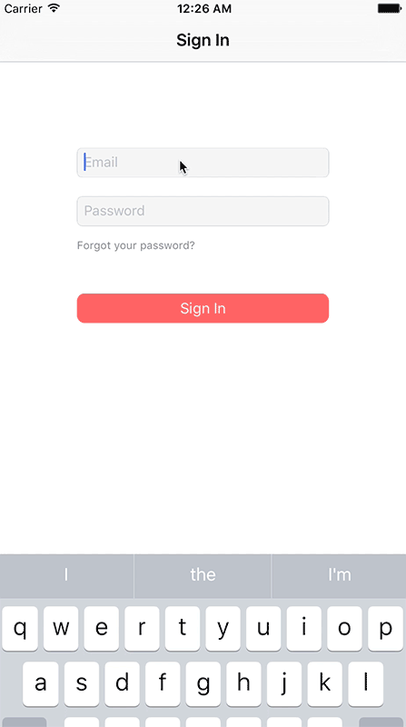

# iOSLibrary
*Akkey select library for iOS*  
I posted what I thought would use. Please refer to it when developing.

| Name | Image | Link |
|:----------:|:----------:|:-------------|
| DejaTextView |  | [GitHub](https://github.com/markusschlegel/DejaTextView) |
| KMPlaceholderTextView |  | [GitHub](https://github.com/MoZhouqi/KMPlaceholderTextView) |
| ParkedTextField |  | [GitHub](https://github.com/gmertk/ParkedTextField) |
| ASAutoResizingTextView |  | [GitHub](https://github.com/svetlanama/ASAutoResizingTextView) |
| PasswordTextField |  | [GitHub](https://github.com/PiXeL16/PasswordTextField) |
| - | - | [GitHub](https://github.com/CosmicMind/Material) |
| - | - | [GitHub](https://github.com/Yalantis/PullToMakeFlight) |
| - | - | [GitHub](https://github.com/gizmosachin/ColorSlider) |
| - | - | [GitHub](https://github.com/Marxon13/M13Checkbox) |
| - | - | [GitHub](https://github.com/ipraba/EPSignature) |
| - | - | [GitHub](https://github.com/keithito/SimpleAnimation) |
| - | - | [GitHub](https://github.com/honghaoz/Swift-CAAnimation-Closure) |
| - | - | [GitHub](https://github.com/daltoniam/DCAnimationKit) |
| - | - | [GitHub](https://github.com/gkye/GKAutoScrollingView) |
| - | - | [GitHub](https://github.com/tbaranes/FittableFontLabel) |
| - | - | [GitHub](https://github.com/suzuki-0000/CountdownLabel) |
| - | - | [GitHub](https://github.com/PrashantMangukiya/SwiftUIDemo) |
| - | - | [GitHub](https://github.com/nttcom/SkyWay-iOS-Sample) |
| - | - | [GitHub](https://github.com/nttcom/SkyWay-iOS-SDK) |
| - | - | [GitHub](https://github.com/skyway/webrtc-handson-native) |
| - | - | [GitHub](https://github.com/KyoheiG3/PagingView) |
| - | - | [GitHub](https://github.com/inaka/FadeButton/tree/master) |
| - | - | [GitHub](https://github.com/liuzhiyi1992/SpreadButton) |
| - | - | [GitHub](https://github.com/MillmanY/MMLoadingButton) |
| - | - | [GitHub](https://github.com/okmr-d/DOHamburgerButton) |
| - | - | [GitHub](https://github.com/okmr-d/DOFavoriteButton) |
| - | - | [GitHub](https://github.com/yoavlt/LiquidFloatingActionButton) |
| - | - | [GitHub](https://github.com/yabuzaki/YBAlertController) |
| - | - | [GitHub](https://github.com/vikmeup/SCLAlertView-Swift) |
| - | - | [GitHub](https://github.com/ltebean/LTWaveEmitterView) |
| - | - | [GitHub](https://github.com/marty-suzuki/SAWaveToast) |
| - | - | [GitHub](https://github.com/zhxnlai/ZLSinusWaveView) |
| - | - | [GitHub](https://github.com/alankarmisra/SwiftSiriWaveformView) |
| - | - | [GitHub](https://github.com/ninjaprox/NVActivityIndicatorView) |
| - | - | [GitHub](https://github.com/BrikerMan/BMPlayer) |
| - | - | [GitHub](https://github.com/mobileplayer/mobileplayer-ios) |
| - | - | [GitHub](https://github.com/zhxnlai/ZLMusicFlowWaveView) |
| - | - | [GitHub](https://github.com/Aufree/ESTMusicIndicator) |
| - | - | [GitHub](https://github.com/nst/STTwitter) |
| - | - | [GitHub](https://github.com/AaronRandall/Screentendo) |
| - | - | [GitHub](https://github.com/cjwirth/awesome-ios-ui) |
| - | - | [GitHub](https://github.com/KentarouKanno/SegmentChangeTable) |
| - | - | [GitHub](https://github.com/jathu/UIImageColors) |
| - | - | [GitHub](https://github.com/zvonicek/ImageSlideshow) |
| - | - | [GitHub](https://github.com/hyperoslo/ImagePicker) |
| - | - | [GitHub](https://github.com/lbrndnr/ImagePickerSheetController) |
| - | - | [GitHub](https://github.com/mcmatan/ImageOpenTransition) |
| - | - | [GitHub](https://github.com/marty-suzuki/SABlurImageView) |
| - | - | [GitHub](https://github.com/wangjwchn/AImage) |
| - | - | [GitHub](https://github.com/celian-m/CMImageLoader) |
| - | - | [GitHub](https://github.com/ddhhz/WHRoundedImageView) |
| - | - | [GitHub](https://github.com/LeoMobileDeveloper/ImageMaskTransition) |
| - | - | [GitHub](https://github.com/jithinpala/JBImageViewTransition) |
| - | - | [GitHub](https://github.com/jhong70/JKHImageZoomTransition) |
| - | - | [GitHub](https://github.com/JanHalozan/SFFullscreenImageDetailViewController) |
| - | - | [GitHub](https://github.com/dropbox/SwiftyDropbox) |
| - | - | [GitHub](https://github.com/yannickl/DynamicColor) |
